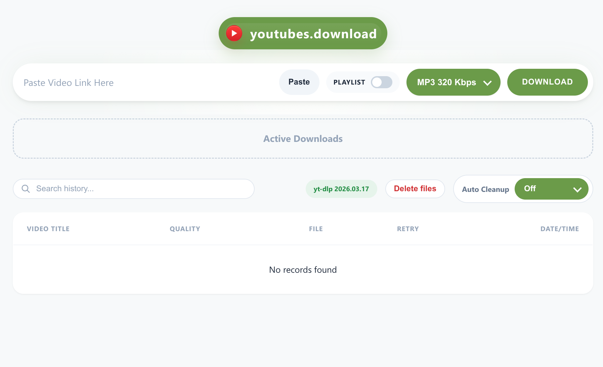

# youtubes.download

Local YouTube downloader built with FastAPI, SQLite, plain HTML/CSS/JS, and Docker.



## English

### Overview

`youtubes.download` is a single-container web app for downloading YouTube audio and video locally. It keeps a lightweight history, supports playlist workflows, and runs as a plain Docker container without Docker Compose, Docker stack deployment, or custom networks.

### Features

- Download YouTube videos as `MP3`, `MP4 720p`, or `MKV` for higher resolutions.
- Start playlist downloads and inspect playlist item details.
- Track active downloads in real time with progress updates.
- Browse download history with server-driven pagination at 10 records per page.
- Delete local files without removing history entries.
- Configure automatic cleanup from the UI.
- Show a branded favicon in the browser tab.
- Embed richer metadata into downloaded video files for better file properties support.
- Run as one Docker container on the default Docker `bridge` network.

### Stack

- FastAPI
- SQLite
- SQLAlchemy
- Socket.IO
- Static HTML, CSS, and JavaScript frontend
- Docker
- `yt-dlp` + `ffmpeg`

### Quick Start

1. Build the image:

```bash
docker build --no-cache -t youtubes-download .
```

2. Start the container:

```bash
docker run -d --name youtubes-download -p 80:80 --restart unless-stopped youtubes-download
```

3. Open:

```text
http://localhost
```

### Configuration

- Runtime state is stored under `runtime/`.
- The app is intended to run as a single container.
- No Docker Compose, Docker stack, swarm configuration, overlay network, or custom network is required.

### Notes and Limitations

- Clipboard paste support depends on the browser security context.
- Download success still depends on `yt-dlp`, `ffmpeg`, and the current availability of the source content on YouTube.
- Rich file properties are best on `MP4`; `MKV` metadata is written too, but some file managers expose fewer fields.
- The container listens on port `80` and uses Docker's default `bridge` network mode.

## ქართული

### აღწერა

`youtubes.download` არის single-container ვებ აპი, რომელიც YouTube-ის აუდიოს და ვიდეოს ლოკალურად ჩამოსატვირთადაა აწყობილი. აქვს მსუბუქი ისტორია, playlist workflow-ები და Docker-ში ერთი კონტეინერით მუშაობს Docker Compose-ის, Docker stack-ის, swarm-ის ან custom network-ის გარეშე.

### შესაძლებლობები

- YouTube ვიდეოების ჩამოტვირთვა `MP3`, `MP4 720p` და მაღალი ხარისხის `MKV` ფორმატებში.
- Playlist download-ების გაშვება და playlist item-ების დეტალების ნახვა.
- აქტიური პროცესების რეალურ დროში პროგრესის კონტროლი.
- ისტორიის ნახვა server-driven pagination-ით, თითო გვერდზე 10 ჩანაწერით.
- ლოკალური ფაილების წაშლა ისტორიის შენარჩუნებით.
- Auto Cleanup-ის მართვა პირდაპირ UI-დან.
- ბრაუზერის ტაბში პროექტის branded favicon-ის ჩვენება.
- ვიდეო ფაილებში richer metadata-ის ჩაწერა უკეთესი file properties-სთვის.
- ერთი Docker კონტეინერით გაშვება default `bridge` ქსელზე.

### ტექნოლოგიები

- FastAPI
- SQLite
- SQLAlchemy
- Socket.IO
- Static HTML, CSS და JavaScript
- Docker
- `yt-dlp` + `ffmpeg`

### სწრაფი გაშვება

1. ააწყე image:

```bash
docker build --no-cache -t youtubes-download .
```

2. გაუშვი კონტეინერი:

```bash
docker run -d --name youtubes-download -p 80:80 --restart unless-stopped youtubes-download
```

3. გახსენი:

```text
http://localhost
```

### კონფიგურაცია

- runtime state ინახება `runtime/` საქაღალდეში.
- პროექტი გამიზნულია ერთ კონტეინერზე გასაშვებად.
- Docker Compose, Docker stack, swarm, overlay network ან ცალკე network საჭირო არ არის.

### შენიშვნები

- Paste ფუნქცია დამოკიდებულია ბრაუზერის security context-ზე.
- ჩამოტვირთვის წარმატება დამოკიდებულია `yt-dlp`-ზე, `ffmpeg`-ზე და YouTube-ზე შინაარსის ხელმისაწვდომობაზე.
- `MP4` ჩვეულებრივ უკეთ აჩვენებს file properties-ს; `MKV`-ზეც metadata იწერება, მაგრამ ზოგი file manager ნაკლებ ველს აჩვენებს.
- კონტეინერი უსმენს `80` პორტს და მუშაობს Docker-ის default `bridge` რეჟიმში.
